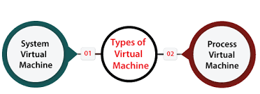

# Virtual Machines

In computing, a virtual machine (VM) is the virtualization or emulation of a computer system. Virtual machines are based on computer architectures and provide the functionality of a physical computer. Their implementations may involve specialized hardware, software, or a combination of the two.

## History of Virtual Machine

The concept of the virtual machine was invented by IBM as a method of time-sharing extremely expensive mainframe hardware in the late 1960s and early 1970s.

## How does it work?

Virtual machines are made possible through virtualization technology. Virtualization uses software to simulate virtual hardware that allows multiple VMs to run on a single machine. The physical machine is known as the host while the VMs running on it are called guests.

## Types of Virtual Machines

* System virtual machine.
* Process virtual machine.
### System virtual machines 

also called **full virtualization VMs**, provide a substitute for a real machine. They provide the functionality needed to execute entire operating systems. A hypervisor uses native execution to share and manage hardware, allowing for multiple environments that are isolated from one another yet exist on the same physical machine. Modern hypervisors use hardware-assisted virtualization, with virtualization-specific hardware features on the host CPUs providing assistance to hypervisors.

### Process virtual machines

sometimes called an **application virtual machine, or Managed Runtime Environment (MRE)**, runs as a normal application inside a host OS and supports a single process. It is created when that process is started and destroyed when it exits. Its purpose is to provide a platform-independent programming environment that abstracts away details of the underlying hardware or operating system and allows a program to execute in the same way on any platform.